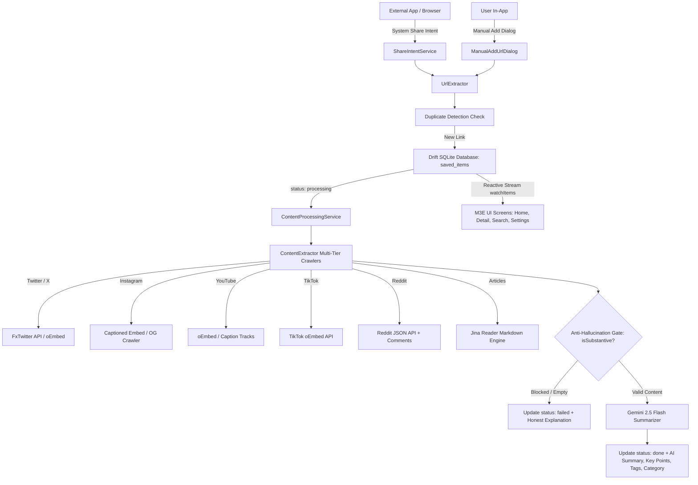

# Recall — Features & Architecture Guide

Welcome to **Recall**, a modern, expressive Flutter application designed to save, extract, summarize, and categorize web links (articles, YouTube videos, X/Twitter posts, Instagram reels/posts, TikToks, Reddit threads) so your saved bookmarks never pile up unread.

---

## 1. High-Level Architecture & Tech Stack



### Core Technologies
- **Framework**: Flutter 3.44+ / Dart 3.12
- **UI Design System**: `material_3_expressive` (M3E buttons, cards, chips, app bars, sheets, floating toolbars)
- **State Management**: Riverpod (code-generation `@riverpod` annotations)
- **Local Persistence**: Drift (SQLite) for 100% private, on-device local storage
- **AI Engine**: Google Gemini 2.5 Flash (direct on-device API client with JSON contract)
- **Networking**: `dio` with custom user-agents and multi-strategy fallbacks
- **Routing**: `go_router`
- **Native Integrations**:
  - `receive_sharing_intent`: Cold-start and live background share sheet receiver
  - `flutter_local_notifications`: Scheduled weekly digest notifications
  - `share_plus`: Native system share sheets
  - `url_launcher`: External browser & deep-linking
  - `cached_network_image`: Smooth image caching and placeholder loading

---

## 2. Feature Breakdown & Working Mechanisms

### 2.1 Share-to-Save & Manual Link Adding
- **System Share Sheet Integration**: Users can tap "Share" in any Android/iOS app (Chrome, Twitter, YouTube, Instagram, etc.) and select **Recall**.
- **Cold-Start & Runtime Streams**: [`ShareIntentService`](file:///c:/Recall/lib/features/save/share_intent_service.dart) listens for `getInitialMedia` (cold launch) and `getMediaStream` (when app is running in background).
- **Noisy Text URL Extraction**: [`UrlExtractor`](file:///c:/Recall/lib/core/utils/url_extractor.dart) uses regex to extract valid `http`/`https` URLs from noisy strings (e.g. `"Check out this article: https://example.com/post?id=123 (via Twitter)"`).
- **Duplicate Detection**: Before saving, [`ManualAddUrlDialog`](file:///c:/Recall/lib/features/save/widgets/manual_add_url_dialog.dart) queries Drift SQLite via [`getItemByUrl`](file:///c:/Recall/lib/core/database/app_database.dart). If the URL is already saved, a dialog warns the user with options to **"View Existing"** or **"Save New Copy"**.
- **Non-Blocking Feedback**: When a link is received, a new record with `status: 'processing'` is instantly created in SQLite, and a [`SaveConfirmationSheet`](file:///c:/Recall/lib/features/save/widgets/save_confirmation_sheet.dart) pops up showing a wavy progress spinner. The user can dismiss it immediately; processing continues in the background.

---

### 2.2 Multi-Tier Content Extraction Pipeline
Every platform has distinct anti-scraping and rendering requirements. [`ContentExtractor`](file:///c:/Recall/lib/core/extraction/content_extractor.dart) implements tailored multi-tier fallbacks:

| Platform | Tier 1 (Primary) | Tier 2 (Secondary) | Tier 3 (Fallback) |
| :--- | :--- | :--- | :--- |
| **Twitter / X** | **FxTwitter API** (`api.fxtwitter.com/status/{id}`): Retrieves tweet text, author info, media photos. | **Official oEmbed** (`publish.x.com/oembed`): Strips HTML markup to extract tweet text. | **Jina Reader** (`r.jina.ai/{url}`) |
| **Instagram** | **Captioned Embed HTML** (`/p/{code}/embed/captioned/`): Extracts JSON caption payloads. | **Social Crawler UA** (`facebookexternalhit/1.1`): Fetches OpenGraph `og:title`, `og:description`, `og:image`. | **Jina Reader** |
| **YouTube** | **oEmbed Metadata** (`youtube.com/oembed`): Fetches high-res thumbnail (`hqdefault.jpg`), title, author. | **Timed Caption Tracks**: Extracts subtitle XML/JSON tracks when available. | **Page OpenGraph** |
| **TikTok** | **Official oEmbed** (`tiktok.com/oembed`): Extracts title, creator name, cover thumbnail. | **Jina Reader** | **Generic Web Parser** |
| **Reddit** | **Reddit JSON API** (`{url}.json`): Custom Reddit User-Agent extracting submission title, selftext markdown, target link, and top community comments. | **Jina Reader** | **Generic Web Parser** |
| **Articles & Blogs** | **Jina Reader Engine** (`https://r.jina.ai/{url}`): Converts complex web pages, JavaScript apps, and articles into clean, readable Markdown. | **Direct HTML Parser**: Extracts standard meta tags (`og:title`, `og:description`, article paragraphs). | — |

---

### 2.3 Anti-Hallucination Validation Gate
- **The Problem**: When auth-walled or JS-heavy websites block automated web scrapers, naive scrapers return generic boilerplate (e.g. `"Log in to Instagram to view photos"`). If passed to an AI model, the model hallucinates generic summaries describing hyperlinks rather than actual post content.
- **The Solution**:
  1. [`_hasSubstantiveContent`](file:///c:/Recall/lib/core/extraction/content_extractor.dart) inspects extracted text against blacklisted blocker signatures (`"log in • instagram"`, `"just a moment..."`, `"cloudflare"`, `"javascript is not available"`).
  2. If content is blocked or empty, the extractor marks `isSubstantive: false` and sets an explanatory error message.
  3. [`ContentProcessingService`](file:///c:/Recall/lib/core/services/content_processing_service.dart) intercepts non-substantive results and **bypasses the AI call entirely**, marking the item as `status: 'failed'` in SQLite.
  4. The AI system prompt in [`GeminiService`](file:///c:/Recall/lib/core/ai/gemini_service.dart) enforces an Anti-Hallucination Contract: if text does not contain readable facts, it returns `isCannotSummarize: true`.

---

### 2.4 Manual Caption / Content Pasting
- When a walled-garden link cannot be scraped automatically, the user is never stuck.
- **Access Points**:
  - The **`[🔒 Blocked]`** failure card on [`DetailScreen`](file:///c:/Recall/lib/features/detail/detail_screen.dart) has a prominent **"Paste Caption Manually"** button.
  - The AppBar on `DetailScreen` features an **"Add / Edit Caption"** icon (`Icons.edit_note_rounded`).
- **How It Works**:
  - Opens a modal bottom sheet with a clipboard paste button.
  - Tapping **"Summarize Content"** calls `repository.updateAndResummarize(...)`, which resets the status to `processing`, feeds the user's caption to Gemini 2.5 Flash, and updates the SQLite record to `done` with full AI insights.

---

### 2.5 Home Library Feed & Filtering
- **Reactive UI**: [`HomeScreen`](file:///c:/Recall/lib/features/home/home_screen.dart) watches `savedItemsFeedProvider`, streaming live items from Drift SQLite.
- **Category Filter Pills**: Filter row powered by `M3EChip` with options: `All`, `Technology`, `Business`, `Health`, `Education`, `Entertainment`, `News`, `Food`, `Finance`, `Other`, and `Unread`.
- **Live Search**: Integrated `M3EAppBar.search` debounces and matches queries against titles, AI summaries, URLs, and `#tags`.
- **Swipe to Archive**: Swiping a card right-to-left marks it as read/archived without permanently deleting it.
- **Status Badges**:
  - `processing`: Circular wavy spinner + "Summarizing with AI…"
  - `done`: Category pill + Star icon if favorited
  - `failed`: `[🔒 Blocked]` badge with clear supporting text

---

### 2.6 Item Detail Screen
- **Header**: Hero thumbnail image with rounded corners, full title, and host subtitle link.
- **Badges**: Category chip, estimated reading time (`⏱️ 2 min read`), creation date, and `#tags`.
- **AI Summary Card**: Highlighted container with sparkle icon and plain-language summary.
- **Key Takeaways**: Bulleted list with accent color bullet indicators.
- **Collapsible Extracted Content**: Expandable container showing raw article/post markdown.
- **Floating Bottom Toolbar (`M3EToolbar.floating`)**:
  - **Open**: Launches the original URL in the user's browser via `url_launcher`.
  - **Favorite**: Toggles `isFavorite` in Drift SQLite with instant UI updates.
  - **Archive**: Toggles `isRead` with feedback SnackBar and Undo action.
- **Top Actions**: Native share sheet via `share_plus` and permanent delete with confirmation modal.

---

### 2.7 Multi-Select Bulk Actions
- Long-pressing any card on `HomeScreen` activates **Selection Mode**.
- Users can tap cards to select multiple bookmarks or tap **"Select All"**.
- A docked bottom action bar provides batch operations:
  - **Archive Selected**: Marks all selected items as read.
  - **Favorite Selected**: Adds all selected items to favorites.
  - **Delete Selected**: Prompts a batch confirmation dialog and removes them from SQLite.

---

### 2.8 Markdown & JSON Library Export
- Built for Obsidian, Notion, Bear, and personal backup workflows.
- Accessible via the export icon in the Home AppBar and the **Export & Backup** section in [`SettingsScreen`](file:///c:/Recall/lib/features/settings/settings_screen.dart).
- **Markdown Export**: Formats all bookmarks with `#` headers, metadata lists, AI summaries, bulleted key takeaways, and collapsible raw content.
- **JSON Export**: Serializes all rows with timestamps, UUIDs, categories, and tags.
- Includes one-tap **"Copy to Clipboard"** and **"Share File / Text"** options.

---

### 2.9 Weekly Digest Notifications
- Managed by [`NotificationService`](file:///c:/Recall/lib/core/notifications/notification_service.dart) using `flutter_local_notifications`.
- Users configure their preferred day of week and delivery time in Settings.
- Calculates unread bookmarks saved over the last 7 days and delivers a local notification (e.g. `"You have 8 unread bookmarks from this week. Tap to catch up!"`).
- Tapping the notification opens Recall filtered directly to unread items.

---

### 2.10 Theme & Privacy Settings
- **Theme Modes**: Supports **System**, **Light**, and **Dark** mode powered by `material_3_expressive` and `ThemeController`.
- **Custom Gemini API Key**: Users can edit or provide their own Gemini API key directly from Settings.
- **100% On-Device Privacy**: All bookmarks, raw text, summaries, and tags remain on the user's device inside SQLite.

---

## 3. Database Schema (Drift SQLite)

Table name: `saved_items`

| Column | Type | Constraints / Default | Description |
| :--- | :--- | :--- | :--- |
| `id` | `TEXT` | `PRIMARY KEY` | Unique identifier (e.g. `item_178694...`) |
| `url` | `TEXT` | `NOT NULL` | The original target URL |
| `platform` | `TEXT` | `NOT NULL` | `twitter` \| `instagram` \| `youtube` \| `tiktok` \| `reddit` \| `article` |
| `title` | `TEXT` | `NULLABLE` | Extracted or edited title |
| `thumbnail_url` | `TEXT` | `NULLABLE` | Image / video cover URL |
| `raw_content` | `TEXT` | `NULLABLE` | Raw extracted markdown / transcript / caption |
| `summary` | `TEXT` | `NULLABLE` | AI-generated summary |
| `key_points` | `TEXT` | `NULLABLE` | JSON-encoded list of bullet points (`["..."]`) |
| `category` | `TEXT` | `NULLABLE` | `Technology`, `Business`, `Health`, `Education`, etc. |
| `tags` | `TEXT` | `NULLABLE` | JSON-encoded list of tags (`["flutter", "ai"]`) |
| `status` | `TEXT` | `'processing'` | `'processing'` \| `'done'` \| `'failed'` |
| `is_read` | `BOOLEAN` | `FALSE` | Archive status |
| `is_favorite` | `BOOLEAN` | `FALSE` | Bookmarked / starred status |
| `created_at` | `DATETIME`| `currentDateAndTime` | Timestamp when saved |

---

## 4. AI Summarization JSON Contract

When [`GeminiService.summarize`](file:///c:/Recall/lib/core/ai/gemini_service.dart) runs, it instructs Gemini 2.5 Flash to respond strictly with valid JSON conforming to this contract:

```json
{
  "summary": "1-2 concise, high-signal sentences summarizing the core content.",
  "key_points": [
    "Key takeaway point 1",
    "Key takeaway point 2",
    "Key takeaway point 3"
  ],
  "category": "Technology | Business | Health | Education | Entertainment | News | Food | Finance | Other",
  "tags": ["keyword1", "keyword2", "keyword3"],
  "estimated_read_time_minutes": 2
}
```

---

## 5. Folder Structure & Conventions

```
c:\Recall\
├── android\                    # Android manifest, intent filters, query declarations
├── ios\                        # iOS configuration and share extension target
├── lib\
│   ├── core\
│   │   ├── ai\                 # Gemini AI client & prompt contract
│   │   ├── database\           # Drift SQLite database & table definitions
│   │   ├── extraction\         # Multi-tier web extractors & validation gate
│   │   ├── notifications\      # Local notifications & digest scheduler
│   │   ├── providers\          # Theme controller & global providers
│   │   ├── router\             # GoRouter routes and navigation
│   │   ├── services\           # Content processing orchestration
│   │   ├── theme.dart          # Material 3 Expressive theme tokens & typography
│   │   └── utils\              # URL extractor, export service (Markdown/JSON)
│   ├── data\
│   │   ├── models\             # SavedItem typed data model
│   │   └── repositories\       # SavedItemRepository for SQLite operations
│   └── features\
│       ├── detail\             # Item detail screen & providers
│       ├── home\               # Home feed screen, search, category chips, tiles
│       ├── save\               # Share intent service, dialogs, confirmation sheet
│       ├── search\             # Search screen & suggestions
│       └── settings\           # Settings screen & digest configuration
├── test\                       # 59 automated unit and widget tests
├── APP_OVERVIEW.md             # This comprehensive architecture & feature guide
└── pubspec.yaml                # Project dependencies
```

---

## 6. How to Run & Verify

1. **Run Static Analysis**:
   ```powershell
   dart analyze
   ```
2. **Execute Full Test Suite**:
   ```powershell
   flutter test
   ```
3. **Run on Device / Emulator**:
   ```powershell
   flutter run
   ```
