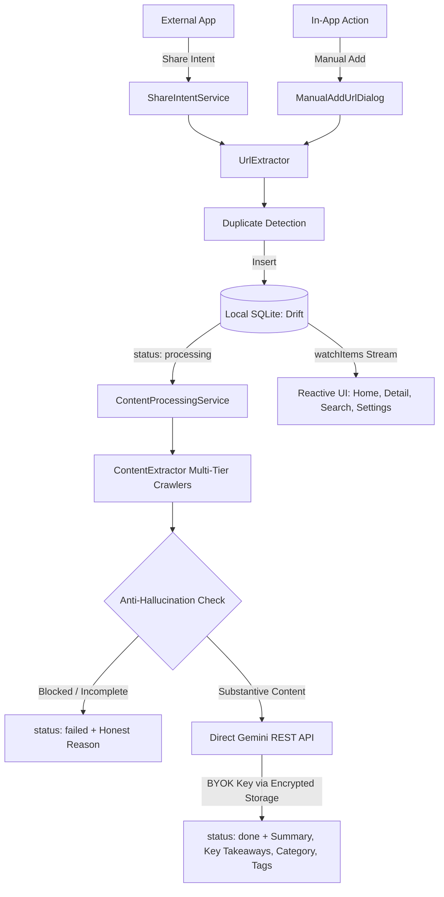

<div align="center">

# 🔖 Recall

### An intelligent, open-source read-later and bookmark summarizer app built with Flutter.

[](https://github.com/your-username/recall/actions)
[](https://flutter.dev)
[](https://dart.dev)
[](https://aistudio.google.com)
[](LICENSE)

*Share links into Recall from any app — Twitter/X, Instagram, YouTube, TikTok, Reddit, or web articles. Recall extracts the substantive content, summarizes it with on-device Google Gemini AI, and auto-categorizes it so your saved links never pile up unread.*

</div>

---

## ✨ Features

- ⚡ **Seamless Share-to-Save**: Share links directly from Chrome, Twitter, YouTube, Instagram, Reddit, TikTok, or any Android/iOS app.
- 🔑 **Bring Your Own Key (BYOK) Architecture**: 100% user-owned credentials. No hardcoded keys or middleman servers. Enter your personal Gemini key; it is validated live and saved strictly in your device's encrypted storage (`flutter_secure_storage`).
- 🤖 **Gemini-powered AI Summarization**: Powered by Google Gemini 2.5 Flash. Delivers a 2-sentence summary, bulleted key takeaways, estimated read time, and auto-generated tags.
- 🛡️ **Anti-Hallucination Gate**: Detects login walls, bot blockers, and empty redirects to prevent AI hallucinations. Displays honest failure states instead of fake summaries.
- ✍️ **Manual Caption Pasting**: Easily paste post captions or transcript excerpts to re-summarize JS-walled content on demand.
- 🗂️ **Category & Filter Tabs**: Filter your library instantly by **All**, **Unread**, **Favorites**, **Blocked**, or topic categories (**Technology**, **Business**, **Health**, **Education**, **News**, etc.).
- 🔍 **Live Debounced Search**: Fast, client-side SQLite search across titles, summaries, URLs, and tags.
- 📦 **Multi-Select Bulk Actions**: Long-press cards to batch archive, favorite, or delete bookmarks.
- 📤 **Markdown & JSON Export**: Export your entire library formatted for Obsidian, Notion, Bear, or raw JSON backup.
- ⏰ **Weekly Digest Notifications**: Configurable local notifications reminding you of unread bookmarks saved during the week.
- 🔒 **100% Private & Local**: Zero third-party tracker servers. All your bookmarks, extracted text, and AI summaries are stored in a local SQLite database (Drift).
- 🎨 **Material 3 Expressive UI**: Adaptive themes (System, Light, Dark) with user-selectable color presets and dynamic wallpaper palettes (`material_3_expressive`).

---

## 🏗️ Architecture



---

## 🚀 Getting Started

### Prerequisites
- [Flutter SDK](https://docs.flutter.dev/get-started/install) (`^3.44.0` or later)
- [Dart SDK](https://dart.dev/get-dart) (`^3.12.0` or later)
- A free [Google Gemini API Key](https://aistudio.google.com/app/apikey)

### Installation

1. **Clone the repository**:
   ```bash
   git clone https://github.com/your-username/recall.git
   cd recall
   ```

2. **Install dependencies**:
   ```bash
   flutter pub get
   ```

3. **Run the app**:
   ```bash
   flutter run
   ```

4. **Connect your Gemini API Key (BYOK)**:
   - Open **Settings** $\rightarrow$ **AI Intelligence** $\rightarrow$ tap **Configure**.
   - Paste your free API key from [Google AI Studio](https://aistudio.google.com/app/apikey).
   - Recall performs a live verification ping against the Gemini API before securely storing the key on your device.

*(Optional for CI/Automated Builds)*: You can also supply a default key at build time using `--dart-define`:
```bash
flutter run --dart-define=GEMINI_API_KEY=your_gemini_api_key_here
```

---

## 🧪 Testing & Code Quality

Recall is built with full test coverage across scrapers, database operations, notifications, and UI flows.

```bash
# Run static analysis
dart analyze

# Run unit and widget tests
flutter test

# Run code generator (if database tables or models change)
dart run build_runner build --delete-conflicting-outputs
```

---

## 📁 Project Structure

```
recall/
├── .github/workflows/         # GitHub Actions CI pipeline
├── assets/empty_states/       # Visual illustrations for empty states
├── android/                   # Android native manifest and configuration
├── ios/                       # iOS native configuration
├── lib/
│   ├── core/
│   │   ├── ai/                # Gemini AI REST client & prompt contracts
│   │   ├── database/          # Drift SQLite database schema & queries
│   │   ├── extraction/        # Multi-tier web extractors (Twitter, IG, YT, Reddit, Articles)
│   │   ├── notifications/     # Local weekly digest notification scheduler
│   │   ├── providers/         # Theme controller & global providers
│   │   ├── router/            # GoRouter navigation & routes
│   │   ├── services/          # Content processing orchestration
│   │   ├── theme.dart         # Material 3 Expressive theme tokens
│   │   └── utils/             # URL extractor & Markdown/JSON export service
│   ├── data/
│   │   ├── models/            # SavedItem data model & JSON serialization
│   │   └── repositories/      # SavedItemRepository SQLite bridge
│   └── features/
│       ├── detail/            # Item detail screen & action toolbar
│       ├── home/              # Home feed, search bar, category chips, tiles
│       ├── save/              # Share intent handler & save sheets
│       ├── search/            # Dedicated search screen
│       └── settings/          # Settings screen, theme selector, API key manager
├── test/                      # Comprehensive unit and widget test suite
└── pubspec.yaml               # Project dependencies and asset declarations
```

---

## 🤝 Contributing

Contributions are welcome! Please check out [CONTRIBUTING.md](CONTRIBUTING.md) to get started.

Please read our [CODE_OF_CONDUCT.md](CODE_OF_CONDUCT.md) before participating in our community.

---

## 🔒 Security

If you discover a security vulnerability, please review our [SECURITY.md](SECURITY.md) for disclosure guidelines. Never commit personal API keys or credentials.

---

## 📄 License

Distributed under the MIT License. See [LICENSE](LICENSE) for more details.
