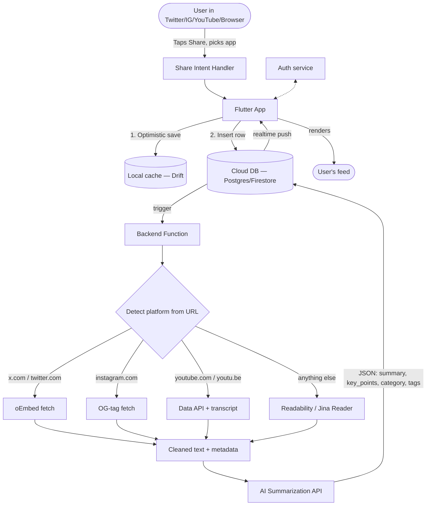
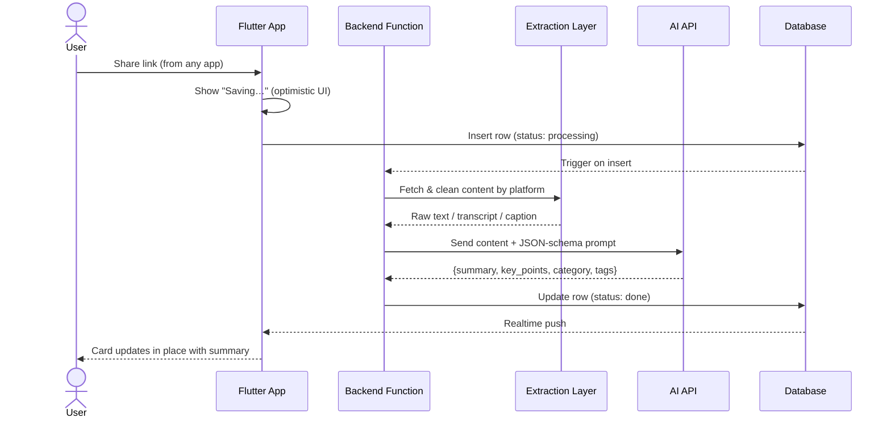
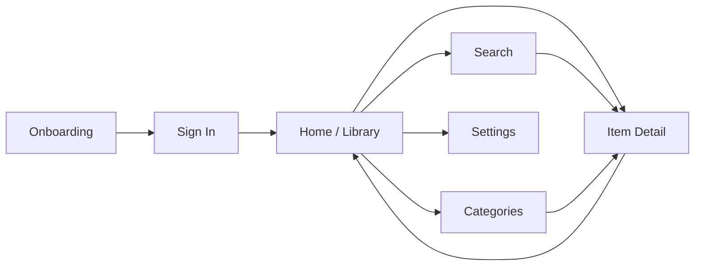

# Save-and-Summarize App — Technical & Product Blueprint

*A single place for tweets, Reels/posts, YouTube videos, and articles that saves itself from becoming a graveyard — auto-categorized and auto-summarized on the way in. Working title used below: "Recall." Swap in your own name.*

**Researched/verified August 2026.** APIs and pricing in this space move fast (X alone has changed its pricing model twice this year) — treat the architecture as solid and the exact dollar figures as "check the source link before you build."

---

## Contents
1. [Concept & Market Context](#1-concept--market-context)
2. [System Architecture](#2-system-architecture)
3. [Tech Stack](#3-tech-stack)
4. [Database Schema](#4-database-schema)
5. [Content Extraction Strategy (per platform)](#5-content-extraction-strategy-per-platform)
6. [AI Summarization & Categorization](#6-ai-summarization--categorization)
7. [Core Workflow — The Save Pipeline](#7-core-workflow--the-save-pipeline)
8. [App Flow & Screens](#8-app-flow--screens)
9. [UI Design](#9-ui-design)
10. [Build Roadmap](#10-build-roadmap)
11. [Cost Estimate](#11-cost-estimate)
12. [Flutter Package Reference](#12-flutter-package-reference)
13. [Sources & Docs to Bookmark](#13-sources--docs-to-bookmark)

---

## 1. Concept & Market Context

The actual problem isn't "saving" — every app on every platform already has a bookmark button. The problem is that saving requires zero commitment, so it doesn't cost anything to save 40 things you'll never revisit. There's no resurfacing layer, no "here's what you actually saved this week," no reason to ever go back in. That's the graveyard.

The wedge for this app is doing the understanding work at save-time instead of read-time: the moment something is saved, it gets read, summarized, and filed — so opening the app is skimming a digest, not re-opening 40 tabs.

Worth knowing as you position this: Mozilla shut down Pocket, one of the category's longest-running players, in mid-2025, and its API went dark that October — so anything that used to integrate with Pocket is currently homeless. The remaining players (Readwise Reader, Instapaper, Raindrop.io, Matter) are mostly organizing tools that treat a tweet, a Reel, a video, and an article as four different kinds of objects. Handling all of them the same way — save it, get a summary, done — is a real gap.

## 2. System Architecture



Everything downstream of "detect platform" is swappable — that's deliberate, because the free/cheap options for Twitter and Instagram extraction are the least stable part of this whole system and you'll likely replace them at least once.

## 3. Tech Stack

### 3.1 Frontend — Flutter

Flutter's current stable is **3.44** (Dart 3.12, shipped at Google I/O in May 2026) — run `flutter --version` and `flutter upgrade` before you start, since a point release or two will likely have landed by the time you're reading this.

| Layer | Pick | Why |
|---|---|---|
| Framework | Flutter 3.44+ | Single codebase for iOS + Android, mature share-intent support |
| UI component kit | **material_3_expressive** (`^1.0.7`) | Direct Material 3 Expressive implementation — see the Design System section below for the full component mapping |
| State management | Riverpod (with code-gen) | Compile-safe, testable; the current default for new projects |
| Navigation | go_router | Official, deep-link friendly — needed since a shared link effectively "deep links" into your app |
| Networking | dio | Interceptors, retries, cleaner than raw `http` |
| Local cache / offline | **drift** (SQLite) | See note below — this replaced Isar as the default |
| Image loading/caching | cached_network_image | Standard for thumbnail-heavy feeds |
| Secure storage | flutter_secure_storage | Auth tokens, API keys |
| Receiving shared links | **receive_sharing_intent** + app_links | The actual entry point of your whole product |
| Sharing back out | share_plus | If you let users re-share a summary |
| Notifications | firebase_messaging or OneSignal | Weekly digest, "you have 12 unread saves" |

**Local database note:** Isar and Hive — both hugely popular a couple of years ago — were abandoned by their original maintainer and are now community-patched at best; Realm lost its sync backing after MongoDB's acquisition wound down. **Drift is the current default recommendation** across the Flutter community for exactly this reason — it's SQL-based, actively maintained, and won't leave you migrating databases mid-project the way teams stuck on Isar have had to.

### 3.2 Backend — Supabase vs. Firebase

| | Firebase | Supabase |
|---|---|---|
| Database | Firestore (NoSQL) | Postgres (SQL) |
| Serverless functions | Cloud Functions (Node/Python) | Edge Functions (Deno/TS) |
| Auth | Firebase Auth | Supabase Auth |
| Realtime | Native, mature | Via Postgres logical replication — solid, slightly newer |
| Free tier | Unlimited projects, but Cloud **Storage was removed from the free Spark plan in Feb 2026** — file storage now needs a pay-as-you-go Blaze account | 500MB DB + 1GB file storage + 50K MAU, no credit card, 2 projects (pause after a week idle) |
| Flutter integration | Official FlutterFire — very mature | supabase_flutter — also mature |
| Bonus | — | **pgvector built in** → cheap semantic search later ("find that thing about intermittent fasting" without the exact words) |

**Recommendation: start with Supabase.** For a solo/early build, not needing a credit card on file just to store thumbnails is a real advantage over Firebase's current free tier, and Postgres + pgvector directly supports the best version of this product (search by meaning, not just keyword). Firebase remains a perfectly good choice if you want the most Flutter-native path and don't mind attaching billing early.

### 3.3 Auth
Use Supabase Auth or Firebase Auth with Google + Apple + email. One real constraint to plan for: **if you offer any third-party social login on iOS, Apple requires you to also offer Sign in with Apple** — easy to miss until App Store review flags it.

## 4. Database Schema

Core table — works as-is in Postgres (Supabase); adapt types for Firestore if you go that route.

```sql
create table saved_items (
  id uuid primary key default gen_random_uuid(),
  user_id uuid references auth.users not null,
  url text not null,
  platform text not null,               -- 'twitter' | 'instagram' | 'youtube' | 'article'
  title text,
  thumbnail_url text,
  raw_content text,                     -- extracted text/transcript, kept so you can re-summarize later
  summary text,
  key_points jsonb,
  category text,
  tags text[],
  status text default 'processing',     -- 'processing' | 'done' | 'failed'
  is_read boolean default false,
  is_favorite boolean default false,
  created_at timestamptz default now()
);

create index on saved_items (user_id, created_at desc);
create index on saved_items using gin (tags);
```

If you add semantic search later, one more column carries the whole feature: `embedding vector(1536)` (pgvector) plus an ivfflat index.

## 5. Content Extraction Strategy (per platform)

This is the part that actually determines whether the app works, and it's genuinely uneven across platforms — worth reading in full before you commit to a build order.

### 5.1 Twitter / X — moderate difficulty
X's official API is no longer a viable option for a personal save-app: since **February 2026 it moved from subscription tiers to pay-per-use with no free read tier** — roughly $0.005 per post read, and legacy Basic/Pro plans ($200 and $5,000/month) are closed to new signups entirely.

The workaround: **X still runs a free, public oEmbed endpoint** (`publish.x.com/oembed?url=...`) that returns embeddable HTML — including the tweet text and author — for any public post, no API key required. Parse the returned HTML for the tweet body and feed that to your summarizer. It's rate-limited and meant for single-post embeds, not bulk scraping, so it's a good fit for "user saves one tweet at a time" but check X's current terms if you ever scale past personal use.

### 5.2 Instagram — hardest of the four
Meta retired the old Basic Display API in December 2024. Everything now runs through the **Instagram Graph API, which only works for content on your own connected Business/Creator account** — there is no endpoint for "fetch any public post by URL," and getting broader access requires Meta App Review (2–6 weeks).

Practical MVP approach: fetch the Instagram post URL directly and read its **Open Graph meta tags** (`og:title`, `og:description`, `og:image`) for a caption preview and thumbnail. No API, no review — but fragile, since Instagram actively pushes back on non-browser traffic (you'll likely need realistic request headers). Worth checking Instagram's Terms of Service against your intended usage before leaning on this heavily; if reliability becomes a real problem, third-party scraping-as-a-service providers are a paid fallback. Be honest with yourself that this is the platform most likely to need a rebuild down the line.

### 5.3 YouTube — easiest, in two parts
**Metadata** (title, channel, thumbnail): YouTube Data API v3, free tier, generous daily quota — comfortably thousands of saves/day.

**Transcripts** (the actually useful part for summarization): there's no simple first-party endpoint for this. The ecosystem runs on unofficial libraries (`youtube-transcript-api` is the standard one) that read YouTube's internal caption endpoint — free, widely used, but can break without warning since it's not a supported API. If you want an SLA instead of DIY, managed transcript APIs exist with usable free tiers (e.g., 100 free credits/month, no card) and paid plans beyond that.

### 5.4 Articles / general web — easiest, full stop
Don't hand-parse HTML. Either self-host Mozilla's Readability algorithm (the engine behind Firefox's reader mode) in your backend function, or skip hosting anything: **Jina AI's Reader** — prepend `r.jina.ai/` to any URL — returns clean, LLM-ready markdown of the page. It works with no API key at a light rate limit, and a free key raises that limit substantially. This is genuinely the easy piece of the whole system.

## 6. AI Summarization & Categorization

### 6.1 API comparison

| API | Free tier | Roughly | Best for |
|---|---|---|---|
| **Google Gemini** (Flash-Lite) | Yes — Google AI Studio, no card, ~1,000 req/day | ~$0.10 / $0.40 per 1M tokens beyond that | **Default for MVP** — cheapest paid tier of any major provider if you outgrow free |
| **Groq** (Llama 3.1 8B) | Yes — no card, ~30 RPM | ~$0.05 / $0.08 per 1M tokens | Fastest responses; good backup if Gemini rate-limits you |
| **OpenAI** (Nano-class model) | Trial credit only | ~$0.10–0.20 per 1M input tokens | If you're already in the OpenAI ecosystem/tooling |
| **Anthropic Claude** (Haiku 4.5) | No standing free tier | $1 / $5 per 1M input/output tokens | Strongest reliability at following your exact JSON schema — worth switching to once this is a real product, not just a prototype |
| **Self-hosted** (Ollama + open model) | Free (your compute) | Server cost only | Full control, zero per-call cost, unlimited volume — you own uptime and quality |

Summaries are short inputs/outputs, so even the "expensive" options here cost fractions of a cent per saved item — model choice matters more for reliability and JSON-following than for raw cost at this scale.

### 6.2 Prompt / output schema

Design one call to return everything at once — summary, key points, category, and tags together — rather than four separate calls per item:

```
System:
You summarize saved web content for a personal bookmarking app.
Given the platform, title, and extracted text, respond with ONLY
valid JSON in this exact shape — no markdown, no commentary:

{
  "summary": "1-2 plain-language sentences",
  "key_points": ["point 1", "point 2", "point 3"],
  "category": "one of: Technology, Business, Health, Education,
                Entertainment, News, Food, Finance, Other",
  "tags": ["3-6 lowercase keywords"],
  "estimated_read_time_minutes": 2
}

User:
[platform: YouTube] [title: ...] [content: ...]
```

Two practical tips: keep the category list **fixed** so your filter chips stay finite and clean, and let `tags` stay freeform since that's what actually powers search. Also cap what you send the model (e.g., first ~6,000 characters of a transcript) — you rarely need the whole thing for a good summary, and it keeps token cost predictable.

## 7. Core Workflow — The Save Pipeline



Handle the failure path explicitly — it will happen (a private tweet, a video with no transcript, a paywalled article): set `status: 'failed'` with a short reason, show a "couldn't process — tap to retry, or keep the link anyway" state in the UI rather than silently dropping the item. Nothing kills trust in a save-app faster than saves that vanish.

## 8. App Flow & Screens



- **Onboarding** — what the app does, then a short "here's how to share into it" walkthrough (this is the one thing every new user must learn).
- **Home / Library** — the main feed, category filter chips, search icon.
- **Item Detail** — full summary, key points, original link.
- **Save confirmation** — the lightweight moment right after a share (see below).
- **Search** — full-text across titles/summaries/tags.
- **Categories** — browse by the fixed category set.
- **Settings** — account, digest notification toggle, theme, export.

## 9. UI Design

### 9.1 Design system — Material 3 Expressive

Use **[`material_3_expressive`](https://pub.dev/packages/material_3_expressive)** (`^1.0.7`, MIT license) — a from-scratch implementation of Google's May 2025 Material 3 Expressive spec, 45 widgets across Actions / Selection / Containment / Navigation / Feedback. Worth knowing before you commit to it: Flutter's own core team [explicitly paused official work on M3 Expressive](https://github.com/flutter/flutter/issues/168813) while they decouple `material`/`cupertino` into standalone packages, so this community package — actively maintained, last published within the last two days as of this writing — is currently the most complete way to get the real thing rather than approximating it with plain Material 3. It needs Flutter ≥3.38 (you're on 3.44, so that's covered) and brings in `motor` (spring-physics motion) and `material_new_shapes` (the morphing shape library) as dependencies — both are what give it the bouncier, less-rigid feel that's the whole point of "Expressive."

```dart
// pubspec.yaml
dependencies:
  material_3_expressive: ^1.0.7

// main.dart — M3EMaterialApp replaces MaterialApp outright
void main() => runApp(const MyApp());

class MyApp extends StatelessWidget {
  const MyApp({super.key});
  @override
  Widget build(BuildContext context) {
    return M3EMaterialApp(
      title: 'Recall',
      data: M3EThemeData.light(seedColor: const Color(0xFF6750A4)),
      autoTheming: true,      // follows system light/dark
      dynamicColoring: true,  // Material You seed color on Android 12+
      drawUnderSystemBars: true,
      home: const HomePage(),
    );
  }
}
```

### 9.2 Screen-by-screen component mapping

| Screen | Element | M3E widget |
|---|---|---|
| Home | Top bar + search | `M3EAppBar.search` — sits as a pill, expands into a full search view with suggestions |
| Home | Category filter | `M3EChip(type: M3EChipType.filter, selected: …)` |
| Home | The feed itself | `M3ECardList.builder` of `M3EListItem(headline:, supportingText:, leading:, trailing:)` |
| Home | Swipe to archive | Swap `M3ECardList` for `M3EDismissibleColumn` — identical API, adds swipe-to-dismiss physics for free |
| Home | Manual add (fallback to share-intent) | `M3EFab` |
| Detail | App bar | `M3EAppBar.top` |
| Detail | Summary card | `M3ECard(variant: M3ECardVariant.elevated)` |
| Detail | Category + tags | `M3EChip` |
| Detail | "Open original" / favorite / archive | `M3EToolbar` — a floating pill toolbar docked above the home indicator, instead of a plain button row |
| Save sheet | The sheet itself | `M3EBottomSheet.show` |
| Save sheet | "Summarizing…" state | `M3EProgressIndicator.circularWavy()` — the wavy indicator is one of the signature new M3E shapes |
| Save sheet | Category once detected | `M3EChip` |
| Search | Field + live results | `M3ESearchAnchor.bar` with `suggestionsBuilder` |
| Settings | Toggles | `M3ESwitch` |

Two snippets worth having on hand:

```dart
// Home feed
M3ECardList.builder(
  itemCount: items.length,
  itemBuilder: (context, i) => M3EListItem(
    headline: items[i].title,
    supportingText: items[i].summary,
    leading: PlatformIcon(items[i].platform),
    trailing: M3EChip(label: items[i].category, type: M3EChipType.assist),
    onTap: () => context.push('/item/${items[i].id}'),
  ),
);

// Save confirmation sheet
M3EBottomSheet.show(context, builder: (context) {
  return Padding(
    padding: const EdgeInsets.all(24),
    child: Column(
      mainAxisSize: MainAxisSize.min,
      children: [
        Text('Saved to Recall', style: Theme.of(context).textTheme.titleMedium),
        const SizedBox(height: 12),
        const M3EProgressIndicator.circularWavy(),
        const SizedBox(height: 8),
        const Text('Summarizing…'),
      ],
    ),
  );
});
```

### 9.3 Screens

A companion visual mockup shared alongside this update shows the look in practice — filled tonal cards, a pill search bar, the wavy progress state, and a floating toolbar. Notes per screen:

- **Home / Library** — pill-shaped search bar up top, filled (tonal) filter chips, card-list feed, circular FAB bottom-right for manual saves.
- **Item Detail** — hero thumbnail, summary + key points, floating pill toolbar docked at the bottom instead of a plain button bar.
- **Save confirmation** — bottom sheet with the wavy circular progress indicator while summarizing, resolving to a category chip once done.

## 10. Build Roadmap

**Phase 1 — MVP (2–4 weeks)**
Auth · share-intent handling for **YouTube + articles only** (skip Twitter/Instagram's complexity at first) · one AI API (Gemini free tier) · Home feed + Detail screen + category filter · visible "processing" status.

**Phase 2 — Feature-complete (3–5 weeks)**
Add Twitter (oEmbed) and Instagram (OG-tag) extraction · search · favorites/collections · retry-on-failure handling · weekly digest notification.

**Phase 3 — Polish & scale (ongoing)**
Offline support (Drift cache + sync) · semantic search via pgvector · swap summarization to Claude Haiku for production reliability · home-screen widgets/quick actions · consider a free-tier save cap + paid unlimited tier if you monetize.

## 11. Cost Estimate

Rough numbers at early-stage scale (~1,000 saves/month across all users):

| Item | Estimated monthly cost |
|---|---|
| Backend (Supabase free tier) | $0 |
| AI summarization (Gemini/Groq free tier) | $0–5 |
| AI summarization (switched to Claude Haiku 4.5) | ~$5–15 |
| Content extraction (oEmbed + OG tags + Jina free tier) | $0 |
| YouTube transcripts (managed API, if you skip the unofficial library) | $0–10 |
| Push notifications | $0 |
| **Total** | **roughly $0–30/month** |

The bill scales with users, not with features — the architecture above stays the same from 10 users to 10,000, only the tier/plan changes.

## 12. Flutter Package Reference

| Package | Purpose |
|---|---|
| `material_3_expressive` | The whole UI layer — 45 M3 Expressive components (see Section 9) |
| `motor` + `material_new_shapes` | Spring-physics motion and morph shapes — pulled in automatically by material_3_expressive |
| `receive_sharing_intent` | Receive shared URLs/text from other apps — your core entry point |
| `app_links` | Deep link handling alongside share intents |
| `flutter_riverpod` + `riverpod_generator` | State management |
| `go_router` | Navigation / routing |
| `dio` | HTTP client |
| `drift` + `sqlite3_flutter_libs` | Local database |
| `supabase_flutter` (or `firebase_core` + `cloud_firestore`) | Backend SDK |
| `cached_network_image` | Thumbnail caching |
| `flutter_secure_storage` | Token storage |
| `share_plus` | Share back out |
| `url_launcher` | Open original links |
| `flutter_local_notifications` | Local reminders/digest |

*(Check exact current versions on pub.dev when you add these — package versions churn faster than this document will stay updated.)*

## 13. Sources & Docs to Bookmark

- Flutter release notes — https://docs.flutter.dev/release/release-notes
- X API pricing / oEmbed docs — https://docs.x.com/x-for-websites/oembed-api
- Instagram Graph API — https://developers.facebook.com/docs/instagram-platform
- YouTube Data API v3 — https://developers.google.com/youtube/v3
- Gemini API pricing — https://ai.google.dev/pricing
- OpenAI API pricing — https://platform.openai.com/docs/pricing
- Claude API docs & pricing — https://docs.claude.com
- Groq pricing — https://groq.com/pricing
- Jina Reader — https://jina.ai/reader
- Supabase pricing — https://supabase.com/pricing
- Firebase pricing — https://firebase.google.com/pricing
- `receive_sharing_intent` — https://pub.dev/packages/receive_sharing_intent
- `drift` — https://pub.dev/packages/drift
- `material_3_expressive` — https://pub.dev/packages/material_3_expressive
- Flutter M3 Expressive status (core team) — https://github.com/flutter/flutter/issues/168813
